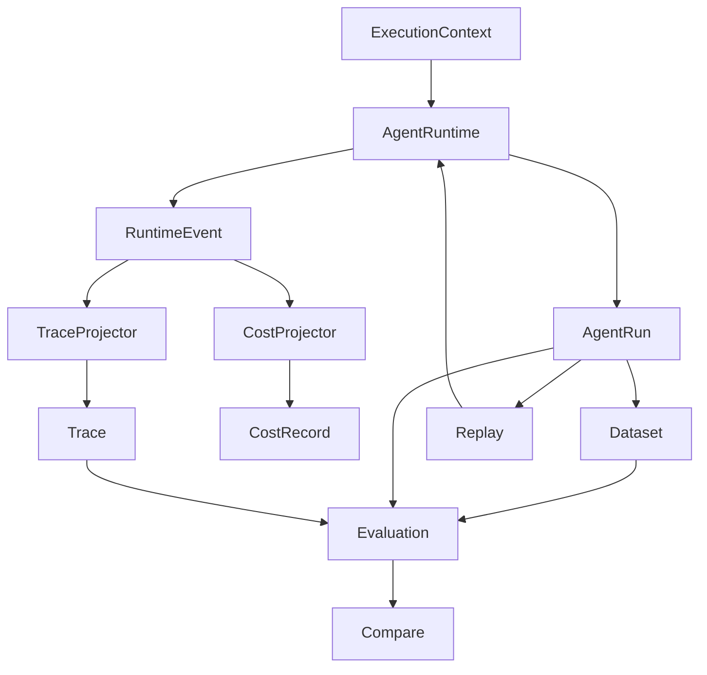

# Execution Model v2

Execution Model v2 is the current execution architecture. Runtime is the source of execution facts; the other packages consume stable contracts and project those facts for their own purpose.

## 1. Core concepts



- **ExecutionContext** owns the identity of one execution (`run_id`, `trace_id`, root span and target).
- **AgentRuntime** performs execution and produces execution facts.
- **RuntimeEvent** is a semantic fact, not merely a log: for example `RunStarted`, `LLMCallCompleted`, `ToolCallCompleted`, `RetrievalCompleted`, `GuardrailBlocked`, and `RunCompleted`.
- **AgentRun** is the logical business boundary and result of a real Runtime execution.
- **Trace** is the observability projection of that execution; it is not the Run.
- **CostRecord** is the cost projection of usage facts.
- **DatasetExample** owns stable regression-example identity (`example_id`).
- **Evaluation** judges a DatasetExample against an AgentRun and, when needed, its Trace.
- **Replay** asks the Runtime to execute historical input again. It does not manufacture execution facts or create an `AgentRun` itself.
- **Compare** compares evaluations for the same DatasetExample across executions.

## 2. Ownership model

| Concept | Owner |
|---|---|
| `run_id`, `trace_id`, root identity | `ExecutionContext` / Runtime |
| `span_id`, `parent_span_id` | Runtime events |
| `AgentRun`, `RuntimeEvent` | `agent_runtime` |
| `Trace`, `Span` | `observability` projector |
| `CostRecord` | `cost_analysis` projector |
| `example_id` | Dataset |
| `EvaluationResult`, `EvaluationRun` | `evaluation` |
| Replay execution | Runtime through `RunExecutor` |
| Comparison | Evaluation / Compare |

Projectors preserve the identity supplied by Runtime. One operation has one span identity; multiple semantic events may enrich the same span (for example `GuardrailEvaluated` and `GuardrailBlocked`). A `span_id` is unique within a Trace.

## 3. Execution lifecycle

Every real execution follows this boundary:

```text
RunStarted
  → semantic Agent / LLM / Tool / Retrieval / Guardrail events
  → exactly one of RunCompleted, RunFailed, RunCancelled
```

This applies to success, failure, cancellation, streaming, workflows, handoffs, delegation, and guardrail-blocked outcomes. A guardrail block is normally a valid business outcome: the Run still exists and terminates with its appropriate normal outcome; it is not automatically a Runtime crash.

## 4. Event to projection flow

```text
AgentRuntime → RuntimeEvent → TraceProjector → Trace / Span
                         └──→ CostProjector  → CostRecord
```

Observability and cost analysis consume events and must not infer missing identity from names, ordering, or internal stores. Malformed or orphaned events are diagnosed and safely degraded; projectors do not invent IDs or parent relationships.

## 5. Evaluation model

The canonical evaluation input is:

```text
DatasetExample + AgentRun + Trace (optional when not needed)
                         ↓
                      Evaluator
                         ↓
                  EvaluationResult
```

Agent-native deterministic evaluators should be preferred for tool usage and arguments, trajectory, step limits, latency, cost, and unhandled errors. LLM judges, RAGAS, and external adapters are optional evaluator implementations, not the core execution model.

The canonical result hierarchy is:

```text
EvaluationRun → ExampleEvaluation[] → EvaluationResult[]
```

A flat `results` list is only a derived compatibility view. `PASS`, `FAIL`, and `SKIPPED` describe evaluator outcomes and may all come from a successful evaluator execution. `EvaluationRun` is failed only for an exception, runner error, or infrastructure failure.

`DatasetExample.example_id` remains stable across baseline and candidate runs; `run_id` does not. Compare validates dataset identity/version and evaluator specifications before comparing results.

## 6. Replay model

```text
Historical Run
      ↓ reuse input/context and target
RunExecutor → AgentRuntime
      ↓
New AgentRun with new Runtime-owned identity
```

Replay preserves the complete historical target, including agent/workflow identity and version, when no target override is supplied. Replay owns neither `run_id`, `trace_id`, nor `AgentRun` creation.

## 7. Dependency direction

```text
agent_runtime → execution contracts/events
observability  → consumes RuntimeEvents
cost_analysis  → consumes RuntimeEvents
evaluation     → consumes Run/Trace contracts
replay         → RunExecutor → Runtime
```

Runtime must not depend on Evaluation or Compare. TraceProjector must not depend on Evaluation, and Replay must use the RunExecutor boundary rather than Runtime internals.

## 8. Invariants

- Run is not Trace.
- Runtime produces facts; consumers do not recreate execution.
- Projectors never generate execution or span identity.
- Replay and Evaluation never construct an `AgentRun` for a real execution.
- `run_id` is not a stable dataset `example_id`.
- Every `RunStarted` has exactly one terminal event.
- Guardrail blocking is not automatically Runtime failure.
- Evaluation outcome is distinct from EvaluationRun execution status.
