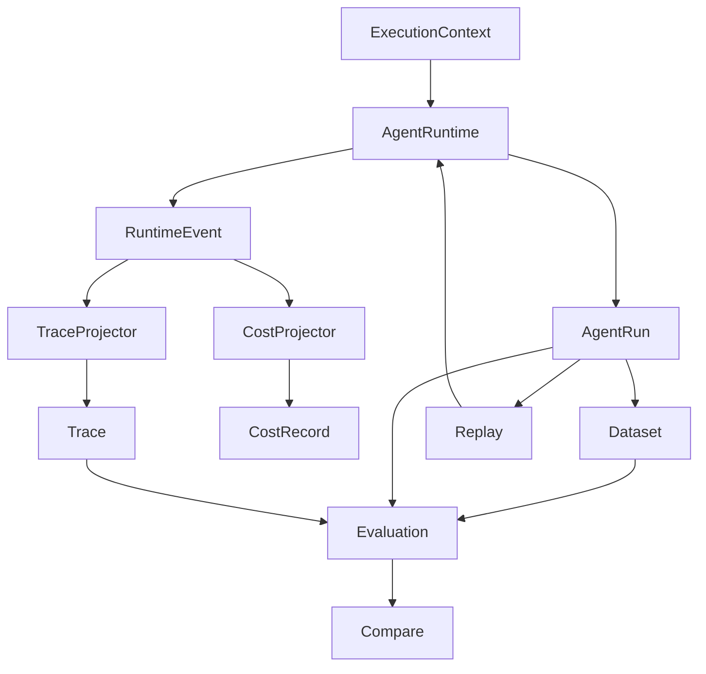

# Execution Model v2

Execution Model v2 is the current execution architecture. Runtime is the source of execution facts; the other packages consume stable contracts and project those facts for their own purpose.

## 1. Core concepts



- **ExecutionContext** owns the identity of one execution (`run_id`, `trace_id`, root span and target).
- **AgentRuntime** performs execution and produces execution facts.
- **RuntimeEvent** is a semantic fact, not merely a log: for example `RunStarted`, `LLMCallCompleted`, `ToolCallCompleted`, `RetrievalCompleted`, `GuardrailBlocked`, and `RunCompleted`.
- **AgentRun** is the logical business boundary and result of a real Runtime execution.
- **Trace** is the observability projection of that execution; it is not the Run.
- **CostRecord** is the cost projection of usage facts.
- **DatasetExample** owns stable regression-example identity (`example_id`).
- **Evaluation** judges a DatasetExample against an AgentRun and, when needed, its Trace.
- **Replay** asks the Runtime to execute historical input again. It does not manufacture execution facts or create an `AgentRun` itself.
- **Compare** compares evaluations for the same DatasetExample across executions.

## 2. Ownership model

| Concept | Owner |
|---|---|
| `run_id`, `trace_id`, root identity | `ExecutionContext` / Runtime |
| `span_id`, `parent_span_id` | Runtime events |
| `AgentRun`, `RuntimeEvent` | `agent_runtime` |
| `Trace`, `Span` | `observability` projector |
| `CostRecord` | `cost_analysis` projector |
| `example_id` | Dataset |
| `EvaluationResult`, `EvaluationRun` | `evaluation` |
| Replay execution | Runtime through `RunExecutor` |
| Comparison | Evaluation / Compare |

Projectors preserve the identity supplied by Runtime. One operation has one span identity; multiple semantic events may enrich the same span (for example `GuardrailEvaluated` and `GuardrailBlocked`). A `span_id` is unique within a Trace.

## 3. Execution lifecycle

Every real execution follows this boundary:

```text
RunStarted
  → semantic Agent / LLM / Tool / Retrieval / Guardrail events
  → exactly one of RunCompleted, RunFailed, RunCancelled
```

This applies to success, failure, cancellation, streaming, workflows, handoffs, delegation, and guardrail-blocked outcomes. A guardrail block is normally a valid business outcome: the Run still exists and terminates with its appropriate normal outcome; it is not automatically a Runtime crash.

## 4. Event to projection flow

```text
AgentRuntime → RuntimeEvent → TraceProjector → Trace / Span
                         └──→ CostProjector  → CostRecord
```

Observability and cost analysis consume events and must not infer missing identity from names, ordering, or internal stores. Malformed or orphaned events are diagnosed and safely degraded; projectors do not invent IDs or parent relationships.

### Retrieval observation

Retrieval attempts are Runtime-owned execution facts nested beneath ToolCall execution:

```text
ToolCall
  └─ Retrieval attempt(s)
```

Each provider attempt has one Retrieval lifecycle. Retries may produce multiple Retrieval spans under one ToolCall. Provenance IDs are optional authoritative facts; bounded result previews are preserved in the event. Trace stores this historical observation and is not a Knowledge store. Consumers must not reconstruct provenance from tool names, result text, or current Knowledge storage.

## 5. Evaluation model

The canonical evaluation input is:

```text
DatasetExample + AgentRun + Trace (optional when not needed)
                         ↓
                      Evaluator
                         ↓
                  EvaluationResult
```

Agent-native deterministic evaluators should be preferred for tool usage and arguments, trajectory, step limits, latency, cost, and unhandled errors. LLM judges, RAGAS, and external adapters are optional evaluator implementations, not the core execution model.

The canonical result hierarchy is:

```text
EvaluationRun → ExampleEvaluation[] → EvaluationResult[]
```

A flat `results` list is only a derived compatibility view. `PASS`, `FAIL`, and `SKIPPED` describe evaluator outcomes and may all come from a successful evaluator execution. `EvaluationRun` is failed only for an exception, runner error, or infrastructure failure.

`DatasetExample.example_id` remains stable across baseline and candidate runs; `run_id` does not. Compare validates dataset identity/version and evaluator specifications before comparing results.

## 6. Replay model

```text
Historical Run
      ↓ reuse input/context and target
RunExecutor → AgentRuntime
      ↓
New AgentRun with new Runtime-owned identity
```

Replay preserves the complete historical target, including agent/workflow identity and version, when no target override is supplied. Replay owns neither `run_id`, `trace_id`, nor `AgentRun` creation.

## 7. Dependency direction

```text
agent_runtime → execution contracts/events
observability  → consumes RuntimeEvents
cost_analysis  → consumes RuntimeEvents
evaluation     → consumes Run/Trace contracts
replay         → RunExecutor → Runtime
```

Runtime must not depend on Evaluation or Compare. TraceProjector must not depend on Evaluation, and Replay must use the RunExecutor boundary rather than Runtime internals.

## 8. Invariants

- Run is not Trace.
- Runtime produces facts; consumers do not recreate execution.
- Projectors never generate execution or span identity.
- Replay and Evaluation never construct an `AgentRun` for a real execution.
- `run_id` is not a stable dataset `example_id`.
- Every `RunStarted` has exactly one terminal event.
- Guardrail blocking is not automatically Runtime failure.
- Evaluation outcome is distinct from EvaluationRun execution status.

## 9. Runtime convergence matrix (Phase 2A)

The following matrix records the execution paths observed in the current
Runtime after commit `9707181` and the intended convergence contract. It is a
working implementation reference for the Runtime migration; the invariant
sections above remain authoritative.

| Entry/path | Current entry and lifecycle behavior | Intended behavior | Current exception/result behavior |
|---|---|---|---|
| Blocking agent (`run`) | `run` creates `ExecutionContext`; `run_turn` prepares, emits `RunStarted`, and the wrapper emits the normal terminal event. Early guardrail completion is terminalized inside `run_turn` and coordinated with `context.metadata["terminal_emitted"]`. | One Runtime-private lifecycle owns context, start, final state, and the completion snapshot. Start is emitted before Runtime preparation; a pre-Runtime Application resolution failure has no Run. | Ordinary agent/model/tool errors return a failed `AgentRun`; the intended task/token cancellation contract finalizes cancelled and raises `CancelledError` (the current wrapper catches task cancellation and returns a cancelled snapshot). |
| Blocking compatibility (`run_turn`) | Can create a second identity when called without a supplied context and can emit its own terminal events. | Public execution uses the single Runtime lifecycle; compatibility methods are thin adapters while consumers migrate. | Preserve handled tool failures and handoff outcomes; propagate ordinary stream/blocking errors according to the public API. |
| Streaming agent (`stream`) | `stream_turn` prepares before `RunStarted`; its generator finalizes semantic events, while `stream` separately builds a snapshot after iteration. | Blocking and stream snapshots come from the same lifecycle state and timing. Finalization precedes the public final completed event yield; `aclose` before terminal is cancelled and yields nothing after `GeneratorExit`. | Ordinary stream errors propagate after one failed terminal; cancellation finalizes cancelled and raises `CancelledError`. Sink failures are logged and do not alter execution. |
| Guardrail early completion | Input blocks are business completions and emit guardrail facts plus `RunCompleted`; blocking and streaming have separate implementations. | Same lifecycle and one terminal event for blocking and stream guardrail paths. | Guardrail block is a completed business outcome, not a Runtime failure. |
| Preparation failure | Blocking and stream preparation failures can occur before the lifecycle start event. | Runtime-invoked preparation failure is a started failed Run; Application target resolution failure remains noRun. | Preserve the original exception on the public stream; blocking returns a failed `AgentRun` where the wrapper contract applies. |
| Model/tool failure and max rounds | Loop and stream paths emit failure events in separate layers; tool business errors are represented as handled results while invocation exceptions fail the execution. | One terminal owner, with handled child/tool failures and workflow policies preserved. | Blocking `run` returns failed `AgentRun`; streaming propagates the exception after finalizing failed. |
| Task/token cancellation | `CancelToken.race` and wrapper catches exist, but cancellation propagation/cleanup is distributed across helpers and generators. | Propagate cancellation through preparation, model, tool, and child calls; clean tasks/generators; finalize cancelled before raising `CancelledError`. | Cancellation is a first-class terminal state, never a failed business result. |
| Delegation/handoff | Sub-execution paths use helper-specific orchestration and may build separate lifecycle state. | Child executions share top-level `run_id`/`trace_id`, use independently parented spans and branch-local stacks, and never finish the root lifecycle. | Preserve handled child failures and the final handoff action/target. |
| Workflow run/stream | `AgentRuntime.run_workflow` and `stream_workflow` build an engine independently; workflow results/events are not attached to one Runtime lifecycle. | Shared lifecycle for run/stream, resolved workflow target ID/version, retained public result/event shapes, shared state store across engine builds, and explicit Runtime resume with a new Run. | Failure policies remain deterministic; `waiting_human` retains its checkpoint and waiting event, and the waiting segment maps to a human-handoff action while a later resume may complete normally. |

### Phase 2A behavior coverage

The Runtime test suite now includes deterministic behavior coverage for
preparation failure, guardrail early completion, model/tool failures, maximum
rounds, task and token cancellation, stream close, nested delegation/handoff,
workflow failure policies, and human wait/checkpoint behavior. Tests marked
`xfail(strict=True)` identify behavior intentionally deferred to Phase 2B;
they are migration assertions rather than permission to weaken the invariant.
